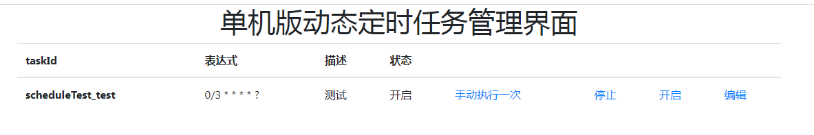
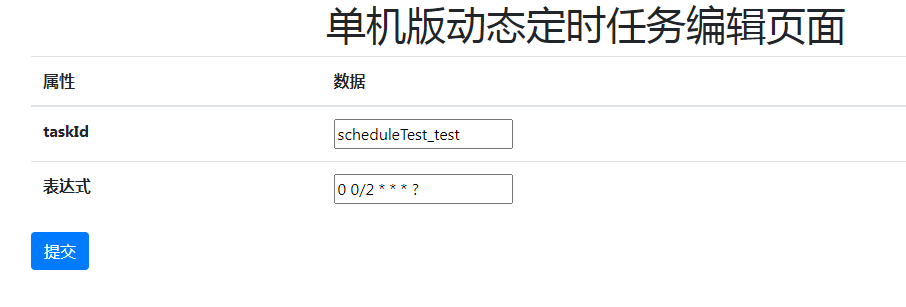
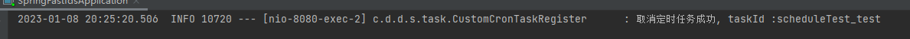
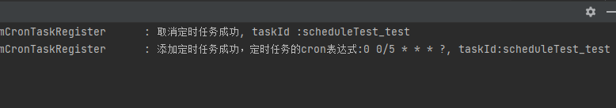

# 1，maven 官方仓库查找

## 1.1 复制maven 的坐标 

```
<dependency>
  <groupId>com.github.ducheng</groupId>
  <artifactId>dynamic-schedule-spring-boot-starter</artifactId>
  <version>0.0.4</version>
</dependency>
```


# 1.2 在springboot 的启动类加上@EnableDynamicScheduling

```java
@SpringBootApplication
//开启动态定时任务的注解
@EnableDynamicScheduling
public class SpringFastfdsApplication {

	public static void main(String[] args) {
		SpringApplication.run(SpringFastfdsApplication.class, args);
	}

}
```

# 1.3  使用案例

## 1.3.1  之前的springboot 整合Schedule 改怎么使用就怎么使用

## 1.3.2 代码片段

```java

@Component
public class ScheduleTest {

    @DynamicScheduled(desc = "测试",cron = "${cron.test}" )
    public void test(){
        System.out.printf("当前时间"+new Date());
    }

}

```

```properties
cron.test=0 0/2 * * * ?
```

## 1.3.3  启动日志


# 1.4 对外暴露的api 

## 1.4.1 查询定时任务列表

请求接口  get 方式请求 http://ip:port/path/dynamicSchedule/getList

返回结果：

```json
[
    {
        "desc": "测试",
        "cronExpression": "0 0/2 * * * ?",
        "taskId": "scheduleTest_test",
        "status": false
    }
]
```

我们看到这个定时任务的状态是默认关闭的， status 为false


## 1.4.2  执行一次定时任务

请求接口  get 方式请求 http://ip:port/path/dynamicSchedule/startOne/{taskId}

taskId 就是上面getlist 返回的

返回结果：



## 1.4.3  开启定时任务

请求接口  get 方式请求 http://ip:port/path/dynamicSchedule/startScheduleTask/{taskId}

taskId 就是上面getlist 返回的

返回结果



## 1.4.4  取消定时任务

请求接口  get 方式请求 http://ip:port/path/dynamicSchedule/removeCronTask/{taskId}

taskId 就是上面getlist 返回的

返回结果




## 1.4.5  修改定时任务

请求接口  post  方式请求 http://ip:port/path/dynamicSchedule/updateSchedule

请求参数 ：

```json
{

     "cronExpression": "0 0/5 * * * ?",
        "taskId": "scheduleTest_test"
}
```

返回结果


