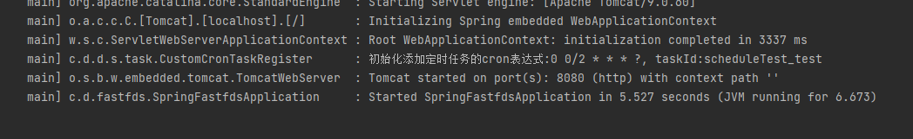

# 1，maven 官方仓库查找

## 1.1 复制maven 的坐标 

```
<dependency>
  <groupId>com.github.ducheng</groupId>
  <artifactId>dynamic-schedule-spring-boot-starter</artifactId>
  <version>0.0.7</version>
</dependency>
```


# 1.2 在springboot 的启动类加上@EnableDynamicScheduling

```java
@SpringBootApplication
//开启动态定时任务的注解
@EnableDynamicScheduling
public class SpringFastfdsApplication {

	public static void main(String[] args) {
		SpringApplication.run(SpringFastfdsApplication.class, args);
	}

}
```

# 1.3  使用案例

## 1.3.1  之前的springboot 整合Schedule 改怎么使用就怎么使用

## 1.3.2 代码片段

```java

@Component
public class ScheduleTest {

    @DynamicScheduled(desc = "测试",cron = "${cron.test}" )
    public void test(){
        System.out.printf("当前时间"+new Date());
    }

}

```

```properties
cron.test=0 0/2 * * * ?
```

## 1.3.3  启动日志



# 1.4 管理界面

##  1.4.1 管理界面查询

查询地址：  http://ip:port/dynamicSchedule/index


## 1.4.2 管理界面编辑


